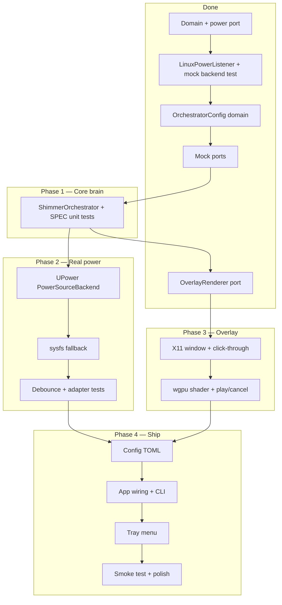

# Power Shimmer — v1 Roadmap

> **Authoritative contracts:** [`SPEC.md`](SPEC.md) · **Stack:** [`TECH_STACK.md`](TECH_STACK.md)  
> **Goal:** Ship a usable Linux daemon that plays a primary-monitor rainbow shimmer on **Battery → AC** only, controlled via **system tray** and **CLI**.

---

## v1 Definition of Done

A laptop on **Linux (X11 + UPower)** can run `power-shimmer` as a background utility that:

1. Subscribes to real power state (UPower, with sysfs fallback when D-Bus is unavailable).
2. On plug-in (**Battery → AC**), plays a ~2s full-screen GPU shimmer on the **primary monitor** (click-through, no focus).
3. Exposes **tray** actions: Play now, Enable/Disable auto shimmer, Quit.
4. Exposes **CLI** flags from SPEC (daemon, `--trigger`, `--dry-run`, `--no-tray`, duration/opacity overrides).
5. Loads optional **TOML** config; respects orchestrator policy (`auto_enabled`, `dry_run`, overlap **Skip** by default).
6. Passes **unit tests** on mock ports and a **Linux integration smoke test** with UPower.

**Explicitly out of v1 scope** (see SPEC “Version Roadmap Hooks”): Wayland overlay (v1.1), Windows/macOS adapters, multi-monitor, hotkeys.

---

## Current Progress (baseline)

| Area | Status | Notes |
|------|--------|--------|
| Workspace & crates | Done | `core`, `platform-linux`, `app`, stubs for win/macOS |
| Domain types | Done | `PowerSource`, `PowerEvent`, `ShimmerConfig`, `OrchestratorConfig`, `OverlapPolicy`, errors in `core::domain` |
| `PowerEventListener` port | Done | `subscribe()` → `PowerEventStream` (`recv` / `recv_timeout`) |
| `OverlayRenderer` port | Done | Trait + SPEC docs in `crates/core/src/ports/overlay.rs`; no platform deps |
| `ShimmerOrchestrator` | Not started | `crates/core/src/services/shimmer_orchestrator.rs` is a stub |
| `OrchestratorConfig` / overlap policy | Done | `domain/config.rs`; defaults: `Skip`, `auto_enabled: true`, `dry_run: false` |
| Generic Linux power listener | **Partial** | `LinuxPowerListener` + `PowerSourceBackend`; emits `InitialState` + `Transition` from injectable backend |
| UPower / sysfs backends | Not started | `upower.rs`, `sysfs_fallback.rs` stubs |
| 400 ms debounce coalescing | Not started | Listener sleeps on debounce but does not coalesce rapid flicker (SPEC) |
| `MockPowerEventListener` (core) | Done | `core::testing::mock_power.rs`; injects `Vec<PowerEvent>` |
| `MockOverlayRenderer` (core) | Done | `core::testing::mock_overlay.rs`; `play_calls`, delay, `cancel()` → `Cancelled` |
| Overlay (X11 + wgpu) | Not started | `wgpu_shimmer.rs`, `x11_click_through.rs` stubs |
| App (CLI, tray, wiring, config) | Not started | `main` prints placeholder message |
| Orchestrator unit tests (SPEC table) | Not started | `orchestrator_test.rs` has mock/config smoke tests only; full SPEC table in Phase 1.6 |
| Mock overlay unit tests (SPEC) | Done | `is_playing`, `Cancelled`, completion covered in `mock_overlay.rs` unit tests |
| Linux power smoke test | Ignored | `linux_power_smoke.rs` placeholder |

**Reference implementation today:** `cargo test -p power-shimmer-core` — 9 tests green (domain defaults, mock port unit tests, integration smoke). Linux listener test: mock backend simulates Battery → AC; `LinuxPowerListener` normalizes it to `PowerEvent::Transition { Battery, Ac }`.

---

## Recommended Build Order

Work top-down in **test-first** slices. Each phase should end with `cargo test` / `./scripts/check.sh` green before the next.



Phases 2 and 3 can proceed in parallel once Phase 1 lands; Phase 4 requires both.

---

## Phase 1 — Core orchestration (mock ports only)

**Objective:** Battery → AC policy and manual triggers work entirely in `core` with no OS or GPU code.

| # | Task | SPEC / files | Acceptance | Status |
|---|------|----------------|------------|--------|
| 1.1 | Add `OrchestratorConfig`, `OverlapPolicy`, defaults | `domain/config.rs` | Compiles; defaults match SPEC (`Skip`, `auto_enabled: true`, etc.) | **Done** |
| 1.2 | Implement `OverlayRenderer` trait in `ports/overlay.rs` | Module 3 | Trait + docs; no platform deps | **Done** |
| 1.3 | `MockPowerEventListener` | `testing/mock_power.rs` | Injects `Vec<PowerEvent>` for tests | **Done** |
| 1.4 | `MockOverlayRenderer` | `testing/mock_overlay.rs` | Records `play_calls`; supports `delay` + `cancel()` → `Cancelled` | **Done** |
| 1.5 | Implement `ShimmerOrchestrator` | Module 4 | `new`, `run`, `trigger_manual`, `update_config`, `set_auto_enabled`, `shutdown` | Not started |
| 1.6 | Orchestrator unit tests | SPEC “Unit Test Requirements” | All rows in orchestrator table pass | Not started |
| 1.7 | Optional: `should_auto_play` as pure fn + tests | Module 4 predicate | Documents policy without integration | Not started |

**Exit criteria:** `cargo test -p power-shimmer-core` covers orchestrator behavior; zero `platform-linux` / `winit` / `zbus` in `core`.

---

## Phase 2 — Linux power adapters (real OS)

**Objective:** Replace the test-only `MockPowerBackend` with production backends while keeping `LinuxPowerListener` unchanged.

| # | Task | SPEC / files | Acceptance |
|---|------|----------------|------------|
| 2.1 | `UpowerBackend` implements `PowerSourceBackend` | `power/upower.rs`, `zbus` | Reads `Online`; maps to `PowerSource` |
| 2.2 | Wire `LinuxPowerListener::new(UpowerBackend::…)` | App wiring (later) or unit test with D-Bus test double | `InitialState` reflects live state in integration |
| 2.3 | `SysfsFallbackBackend` | `power/sysfs_fallback.rs` | Same event protocol; selected when UPower unavailable |
| 2.4 | Backend selection | Adapter detail | UPower preferred; sysfs when D-Bus session missing |
| 2.5 | Debounce coalescing (400 ms) | Module 2 | Two rapid `online` toggles within 400 ms → **one** `Transition` |
| 2.6 | `InitialState { Unknown }` + background retry | Module 2 | Does not block orchestrator when UPower down at startup |
| 2.7 | Unit test: debounce coalescing | SPEC power listener tests | Mock backend pushes flicker; assert single transition |
| 2.8 | Enable `linux_power_smoke` (ignored → run on CI/hardware) | `tests/linux_power_smoke.rs` | Manual/CI: plug AC → receive `Transition(Battery, Ac)` |

**Exit criteria:** Daemon can subscribe to real power on a Linux laptop; listener still does **not** decide shimmer policy.

---

## Phase 3 — Linux overlay (X11 + wgpu)

**Objective:** Satisfy `OverlayRenderer` for primary monitor on X11. **Wayland deferred to v1.1.**

| # | Task | SPEC / files | Acceptance |
|---|------|----------------|------------|
| 3.1 | Add workspace deps to `platform-linux` | `Cargo.toml` | `tokio`, `winit`, `wgpu` per TECH_STACK |
| 3.2 | X11 click-through + window hints | `overlay/x11_click_through.rs` | No focus; pass-through input; hidden from taskbar (best effort) |
| 3.3 | Primary monitor bounds | Visual contract | Full primary display coverage |
| 3.4 | `WgpuShimmerRenderer` implements `OverlayRenderer` | `overlay/wgpu_shimmer.rs` | `play` / `is_playing` / `cancel` |
| 3.5 | WGSL rainbow + shimmer band | `assets/shaders/` | Honors `duration_ms`, `opacity`, `speed` ± one frame |
| 3.6 | Teardown ≤ 500 ms | Module 3 | Resources released after complete or cancel |
| 3.7 | Mock overlay unit tests in `core` or `platform-linux` | SPEC overlay tests | `is_playing`, `Cancelled`, completion | **Done** (core `mock_overlay.rs`) |
| 3.8 | Manual test: `power-shimmer --trigger` | App (Phase 4) | Visible shimmer without power event |

**Exit criteria:** Orchestrator + real overlay completes end-to-end on X11; `wayland_layer_shell.rs` remains stubbed.

---

## Phase 4 — Application shell & release polish

**Objective:** User-facing binary wires everything together.

| # | Task | SPEC / files | Acceptance |
|---|------|----------------|------------|
| 4.1 | TOML config load + defaults | `app/config.rs`, `config/` | `ShimmerConfig` + orchestrator flags |
| 4.2 | `clap` CLI | SPEC CLI table | `--trigger`, `--dry-run`, `--no-tray`, `--duration-ms`, `--opacity` |
| 4.3 | Composition root | `app/wiring.rs` | Builds UPower listener, X11 overlay, orchestrator |
| 4.4 | Tokio runtime + task spawn | TECH_STACK | Power loop in background; overlay on orchestrator tasks |
| 4.5 | Entry paths | SPEC | `--trigger` → manual play + exit; default → daemon |
| 4.6 | System tray | `app/tray.rs`, `tray-icon` | Play now / Enable auto / Quit → orchestrator calls |
| 4.7 | Logging | `tracing` | Dry-run and trigger paths log intent |
| 4.8 | `scripts/check.sh` in CI / docs | README | Format, clippy, test, deny (if configured) |
| 4.9 | Update README status | — | Reflects v1 shipped capabilities |

**Exit criteria:** `cargo run -p power-shimmer-app` (or project binary name) runs daemon on X11; unplug/replug AC triggers shimmer when auto is enabled.

---

## Phase 5 — v1 hardening (before tag)

| # | Task | Notes |
|---|------|--------|
| 5.1 | End-to-end manual test matrix | Boot on AC, boot on battery + plug, unplug (no shimmer), manual play on battery |
| 5.2 | Error paths | Stream ended, overlay failure surfaced in logs without panic |
| 5.3 | Resource leak check | Repeated plug/unplug; memory stable |
| 5.4 | Packaging notes | `.desktop`, install path — optional for first tag |
| 5.5 | SPEC / README sync | Mark implemented modules; link `ROADMAP.md` |

---

## Post-v1 (tracked, not scheduled here)

| Version | Feature | Impact |
|---------|---------|--------|
| **v1.1** | Wayland `layer-shell` overlay | New `OverlayRenderer` impl; `wayland` feature flag |
| **Future** | Windows / macOS | New platform crates; `core` unchanged |
| **Future** | Multi-monitor | Extend `MonitorTarget`; config + orchestrator pass-through |

---

## Quick reference — SPEC modules → crates

| SPEC module | Crate | Path | Roadmap phase |
|-------------|-------|------|----------------|
| Domain types | `core` | `domain/` | Done |
| Power Listener port | `core` | `ports/power.rs` | Done |
| Power Listener adapter | `platform-linux` | `power/listener.rs`, `upower.rs`, `sysfs_fallback.rs` | 2 |
| Overlay Renderer port | `core` | `ports/overlay.rs` | Done |
| Overlay Renderer adapter | `platform-linux` | `overlay/wgpu_shimmer.rs`, `x11_click_through.rs` | 3 |
| Shimmer Orchestrator | `core` | `services/shimmer_orchestrator.rs` | 1 (1.5–1.6 remaining) |
| Test doubles | `core` | `testing/mock_power.rs`, `testing/mock_overlay.rs` | Done |
| CLI / tray / wiring | `app` | `main.rs`, `wiring.rs`, `tray.rs`, `config.rs` | 4 |

---

## Suggested next step

**Phase 1.5–1.6:** Implement `ShimmerOrchestrator` and the full SPEC orchestrator unit test table in `orchestrator_test.rs`. Mock boundaries (tasks 1.1–1.4) are in place — that unlocks parallel work on UPower (Phase 2) and wgpu overlay (Phase 3) without coupling them.

```bash
cargo test -p power-shimmer-core
cargo test -p power-shimmer-platform-linux
./scripts/check.sh
```
